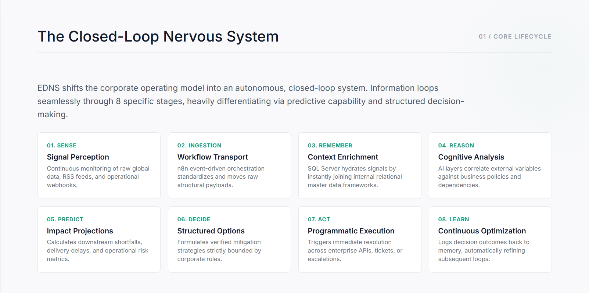
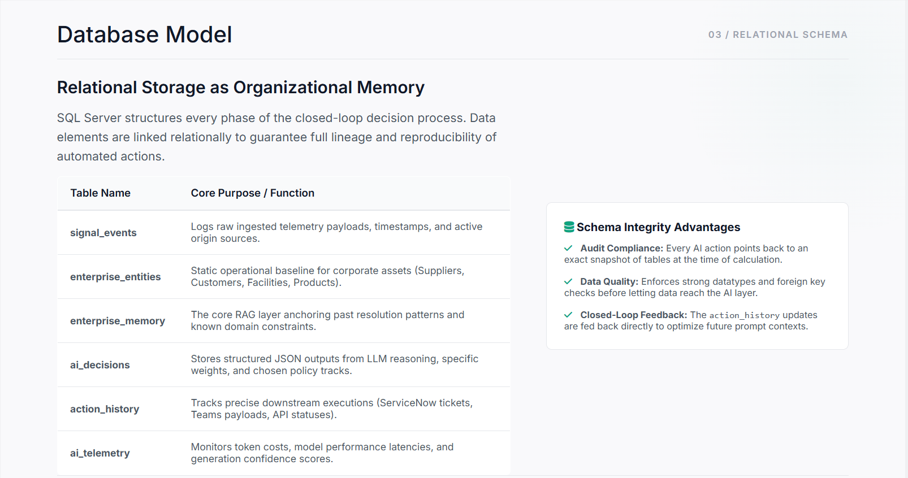

# Enterprise Digital Nervous System (EDNS)

## Enterprise Decision Intelligence Platform

## Why EDNS?

Most AI projects focus on answering questions.

EDNS focuses on operational decision intelligence.

Instead of simply generating responses, EDNS is designed to:

- Detect business signals
- Retrieve organizational memory
- Evaluate operational risk
- Generate recommendations
- Execute actions
- Learn from outcomes

The goal is to create a closed-loop enterprise system that continuously improves decision quality over time.



---

# Business Scenario

### Example: Supplier Delivery Delay

A critical supplier reports a shipment delay.

EDNS automatically:

1. Detects the delay signal
2. Retrieves historical resolution patterns
3. Evaluates operational risk
4. Predicts downstream business impact
5. Generates recommended actions
6. Executes approved workflows
7. Tracks outcomes and feedback
8. Updates organizational memory

Result:

- Faster response time
- Consistent decision quality
- Reduced operational risk
- Continuous learning from outcomes

---

### Overview

Enterprise Digital Nervous System (EDNS) is an AI-powered closed-loop decision intelligence platform designed to help organizations detect signals, understand operational risk, make decisions, execute actions, and continuously improve through feedback-driven learning.

Core Flow:

```text
Sense → Remember → Reason → Predict → Decide → Act → Learn
```

Unlike traditional dashboards or chatbots, EDNS combines:

- SQL Server Enterprise Memory
- AI Decision Intelligence
- Workflow Automation
- Governance & Audit Controls
- Operational Telemetry
- Continuous Learning Loops

---

# Current Build Status

## Phase 1 – Database Foundation ✅ Complete

Implemented and validated in Microsoft SQL Server Express.

### Completed

- EDNS_V1 Database
- 8 Core Tables
- Foreign Key Relationships
- Logical Delete Framework
- Audit & Governance Fields
- Memory Versioning Design
- Seed Data Validation

### Core Tables

| Table | Purpose |
|---------|---------|
| signal_events | Captures incoming business signals |
| enterprise_entities | Master data for suppliers, facilities, customers, and assets |
| enterprise_memory | Organizational memory and historical resolution patterns |
| ai_decisions | AI-generated decisions and recommendations |
| action_history | Executed actions and workflow outcomes |
| ai_telemetry | AI performance and operational metrics |
| decision_feedback | Human and system feedback on decisions |
| learning_execution_log | Continuous learning and memory updates |

---

# Architecture

```text
Business Signals
        ↓
Signal Events
        ↓
Enterprise Memory
        ↓
AI Operations Brain
        ↓
AI Decisions
        ↓
Enterprise Actions
        ↓
Telemetry & Feedback
        ↓
Learning Loop
        ↓
Enterprise Memory Update
```

---

# Entity Relationship Overview



```text
signal_events
      │
      ▼
ai_decisions
      │
      ├── action_history
      ├── ai_telemetry
      └── decision_feedback

enterprise_entities
      │
      ▼
enterprise_memory
```

---

# Technology Stack

## Data Layer

- Microsoft SQL Server Express

## Workflow Layer

- n8n (Planned)

## Intelligence Layer

- OpenAI GPT-4o (Planned)

## Analytics Layer

- Power BI (Planned)

## Communication Layer

- Email Notifications
- Microsoft Teams (Planned)

---

# Database Validation

Successfully validated:

- enterprise_entities seed data
- enterprise_memory seed data
- Foreign key relationships
- Core governance architecture

Current Database:

```text
EDNS_V1
```

---

# Roadmap

## Phase 1
✅ SQL Server Database Foundation

## Phase 2
🚧 n8n Signal Processing Pipeline

## Phase 3
🚧 OpenAI Decision Engine Integration

## Phase 4
🚧 Power BI Decision Intelligence Dashboard

## Phase 5
🚧 Closed-Loop Learning Automation

---

# Skills Demonstrated

- Business Systems Analysis
- Technical Business Analysis
- SQL Server Data Modeling
- Enterprise Architecture
- Workflow Automation Design
- AI Enablement
- Decision Intelligence Design
- Governance & Audit Frameworks

---

# Repository Structure

```text
enterprise-digital-nervous-system/

├── README.md
│
├── sql/
│   ├── README.md
│   └── EDNS_Production_Schema_v1.5.1.sql
│
├── docs/
│   └── README.md
│
├── images/
│   ├── README.md
│   ├── 01-edns-architecture.png
│   ├── 02-edns-memory-layer.png
│   ├── 03-edns-database-model.png
│   ├── 05-edns-visibility-layer.png
│   ├── 06-edns-ai-operations-brain.png
│   └── 07-edns-roadmap.png
│
├── n8n/
│   └── README.md
│
└── powerbi/
    └── README.md
```

# Author

Kaori Kashiwagi

Business Systems Analyst | Enterprise Architecture | AI Automation | Decision Intelligence

Enterprise Digital Nervous System (EDNS)

AI-Powered Closed-Loop Decision Intelligence Platform
